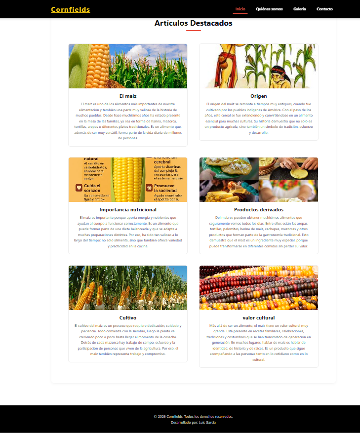
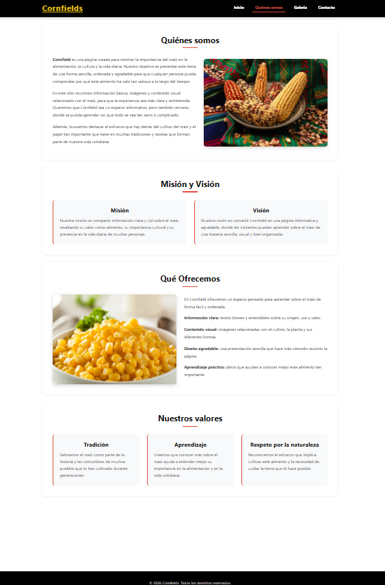
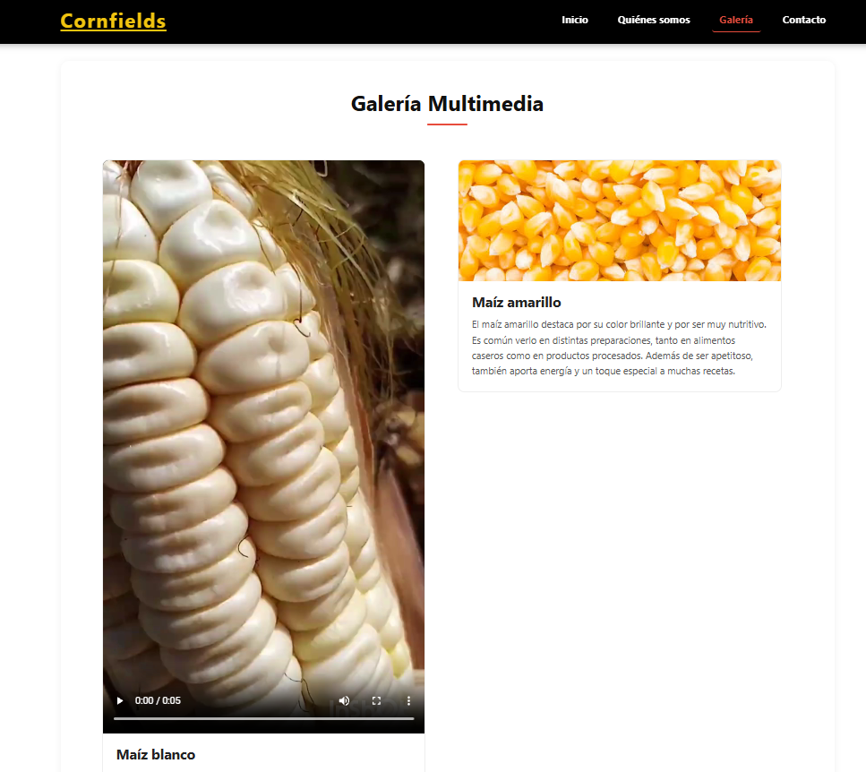
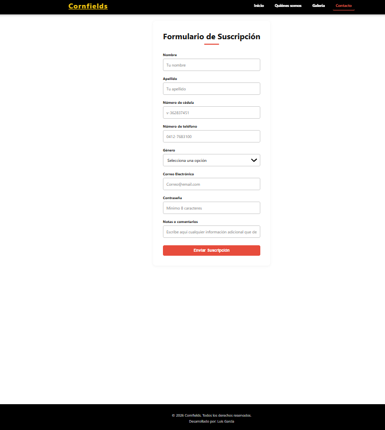

# 🌽 Cornfields

A responsive agricultural information website developed with HTML5 and CSS3. This project was created to practice responsive web design, content organization, multimedia integration, and user-friendly interface development.

---

# 📖 About the Project

Cornfields is an informational website dedicated to the world of corn. It provides visitors with useful information about its origin, importance, varieties, and derivatives through a clean, responsive, and easy-to-navigate interface.

The project includes multimedia content such as images and videos to create a more engaging browsing experience while strengthening my frontend web development skills.

This website was developed as part of my learning journey while studying for my TSU in Informatics.

---

# ✨ Features

- Responsive web design
- Home page with multimedia content
- About Us section
- Image gallery
- Contact page
- Educational information about corn
- Embedded videos
- Organized and easy-to-navigate interface

---

# 🛠️ Technologies

### Frontend

- HTML5
- CSS3

### Multimedia

- Images
- Videos

### Development Tools

- Visual Studio Code
- GitHub

---

# 📁 Project Structure

```text
Cornfields/
│
├── assets/
│   ├── Home.png
│   ├── Gallery.png
│   ├── Contact.png
│   └── Who_we_are.png
│
├── css/
│   └── archivos.css
│
├── imagenes/
│
├── videos/
│
├── index.html
├── quienes-somos.html
├── galeria.html
└── contacto.html
```

---

# 🚀 Installation

1. Clone the repository.

```bash
git clone https://github.com/luGa19943/Cornfields.git
```

2. Open the project folder.

3. Open `index.html` in your preferred web browser.

No additional software or dependencies are required.

---

# ▶️ Running the Project

Simply open:

```text
index.html
```

in any modern web browser.

---

# 📷 Screenshots

## 🏠 Home



---

## 👥 Who We Are



---

## 🖼️ Gallery



---

## 📞 Contact



---

# 🎯 What I Learned

Developing Cornfields helped me strengthen my understanding of:

- HTML5 page structure
- CSS3 styling
- Responsive web design
- Organizing multi-page websites
- Multimedia integration
- Website navigation
- Creating clean and user-friendly interfaces

This project also allowed me to improve my frontend development skills by designing a complete informational website from scratch.

---

# 🔮 Future Improvements

Some improvements I would like to implement in future versions include:

- Interactive image gallery
- Search functionality
- Dark mode
- Accessibility improvements
- Better animations and transitions
- Performance optimization
- Improved mobile experience

---

# 👨‍💻 Author

**Luis García**

Junior Software Developer

- GitHub: https://github.com/luGa19943
- LinkedIn: https://www.linkedin.com/in/lgarcia-dev/
- Email: luisimi78ram32@gmail.com

---

# 📄 License

This project is licensed under the MIT License.
